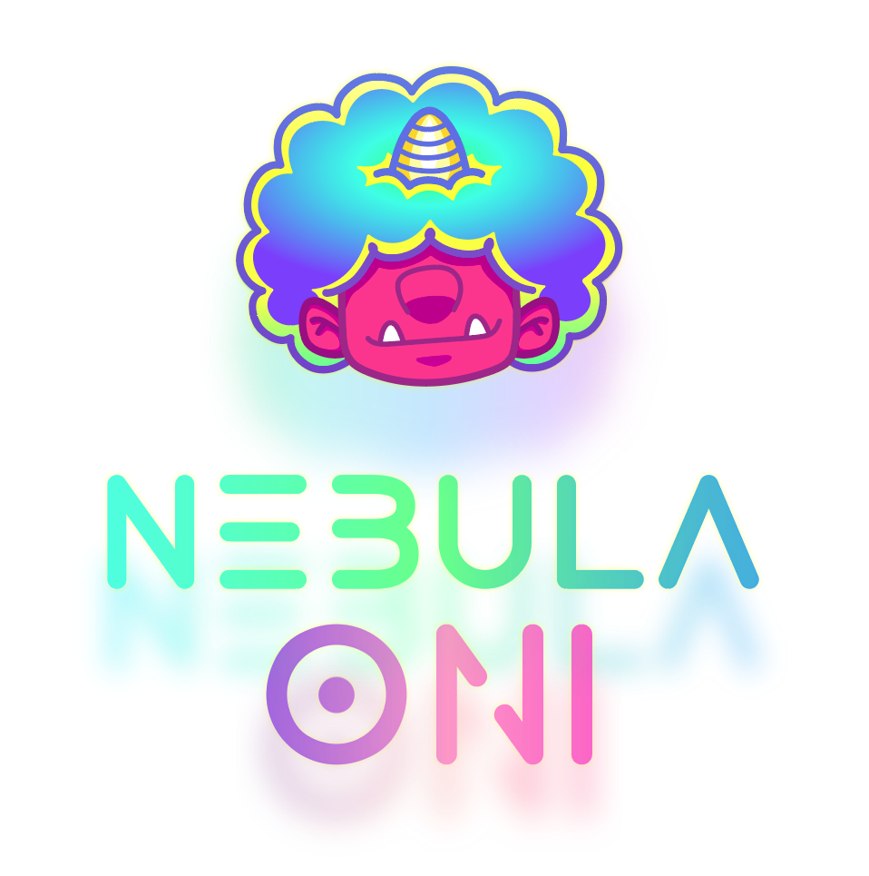

### Table of Contents

- [Nebula Oni Theme](#nebula-oni-theme)
- [Nebula Oni » Theme Options](#nebula-oni--theme-options)
- [Oni UI](#oni-ui)
- [Nebula Syntax](#nebula-syntax)
- [Theme Features](#theme-features)
- [Extensions](#extensions)
- [VSCode Customization](#vscode-customization)
- [Release History](#release-history)
- [Issues and Suggestions](#issues-and-suggestions)
- [References and Links](#references-and-links)
- [Author](#author)
- [License](#license)

## Description <!-- omit in toc -->

**Oni** (鬼) is a type of ogre _youkai_ and **Nebula Oni Theme** has colors from outer space!

This theme has a lot of different options for the **main color**, **background**, **syntax options** and more! You can customize everything and add your own flair through the **extension's menu** in **VSCode's Settings**!

_
 (Syntax: Hourglass / Background: Grey) 
_

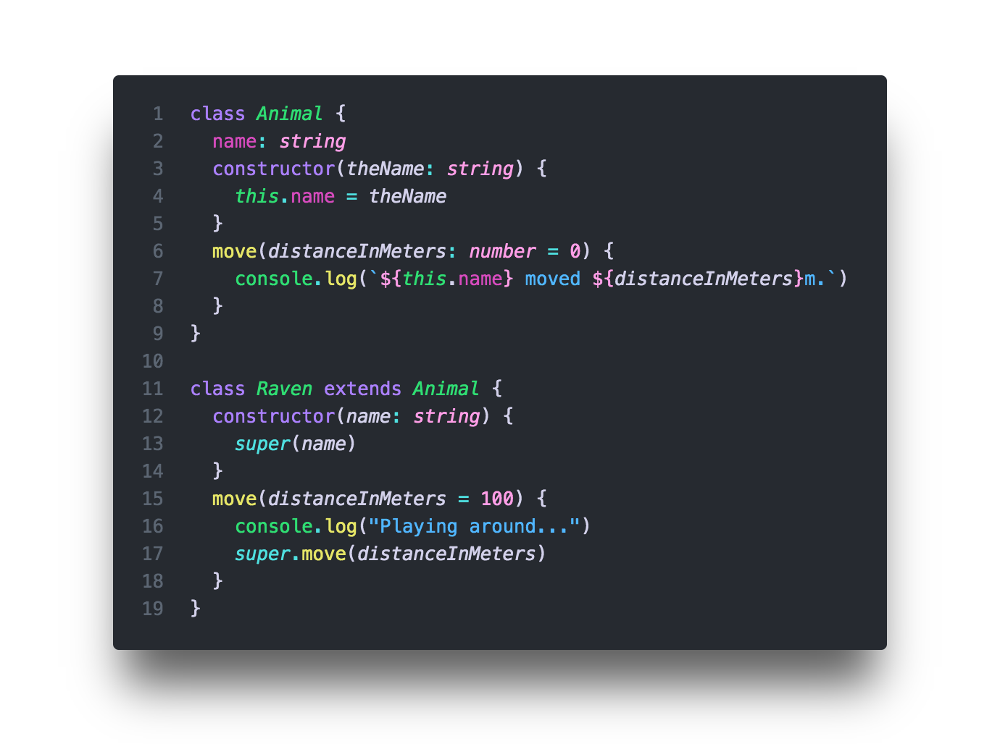

_
 (Syntax: Pegasus / Background: Purple) 
_

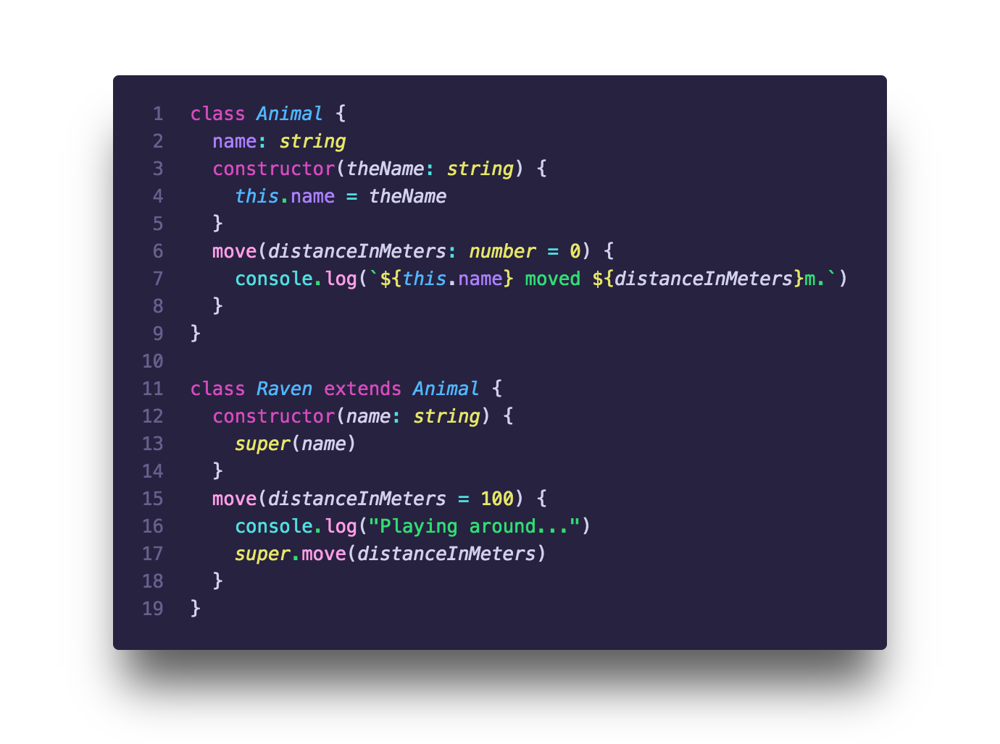

_
 (Syntax: Spirograph / Background: Dark Grey) 
_

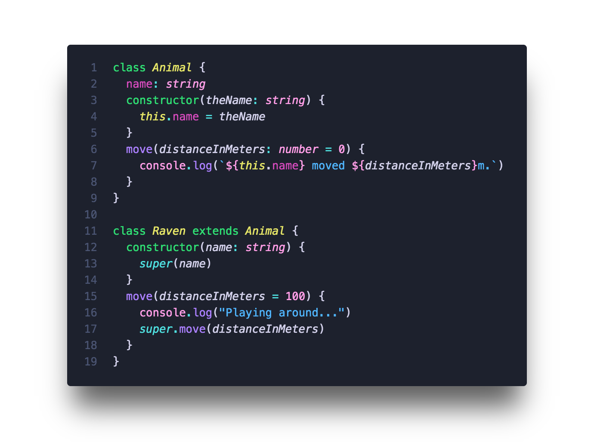

_
 (Syntax: Cerberus / Background: Blue) 
_

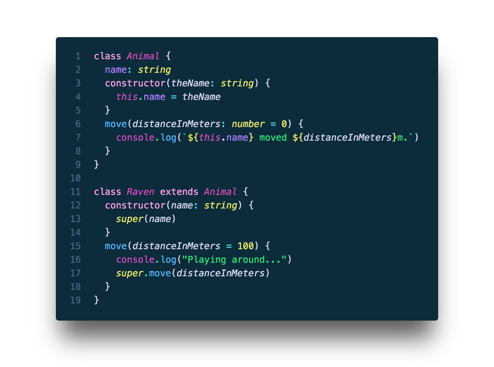

_
 (Main Color: Bumblebee / Background: Grey) 
_

_
 (Main Color: Peach / Background: Blue) 
_

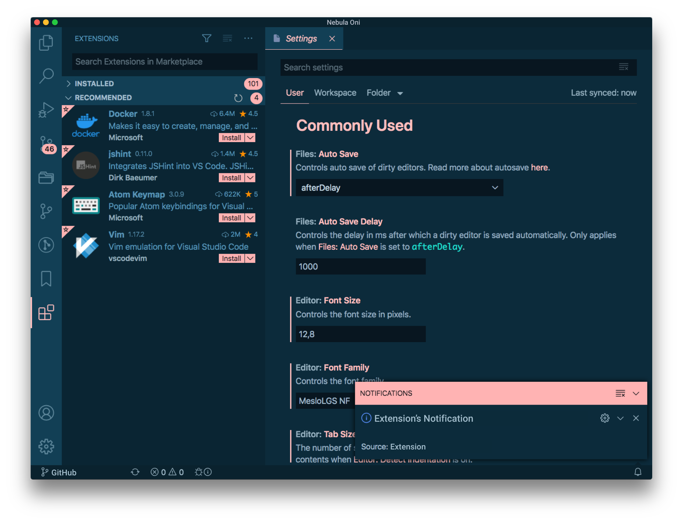

[
⬆
](#table-of-contents)

## Nebula Oni Theme

This started as a simple Atom's [One Dark Syntax](https://github.com/atom/one-dark-syntax) customization by someone that had just finishied his first programming course, had no idea how to change syntax colors and started tweaking the `settings.json` file and it got a bit out of hand and it became this:

> A completely different theme with **multiple UI options** and a **new Syntax** that has nothing to do with the original project.

### Spread Nebula Oni across the Outer Space <!-- omit in toc -->

If you liked this theme and you want to support it, you can do simple things like:

-  **sharing** this theme with friends and colleagues
-  **rating** it on Visual Studio Code **[Market Place](https://github.com/psudo-dev/nebula-oni-theme)**
-  giving it a **star** on **[Github](https://github.com/psudo-dev/nebula-oni-theme)**

There are several ways to help and support it!

-  And if you **really** liked this theme, would you consider [buying me a coffee](https://buymeacoff.ee/psudo.dev)?

## Nebula Oni » Theme Options

For **Oni UI** there are **six** options for the **Main Color** and **six** different colors for **Background**, and you can combine the two in any way you prefer!

You also have options for **italic**, different colors for **comments**, **selection highlight** and more!

And it's all easily customizable through the **Nebula Oni Menu**!

_
 (Main Color: Sakura / Background: Glacial Blue) 
_

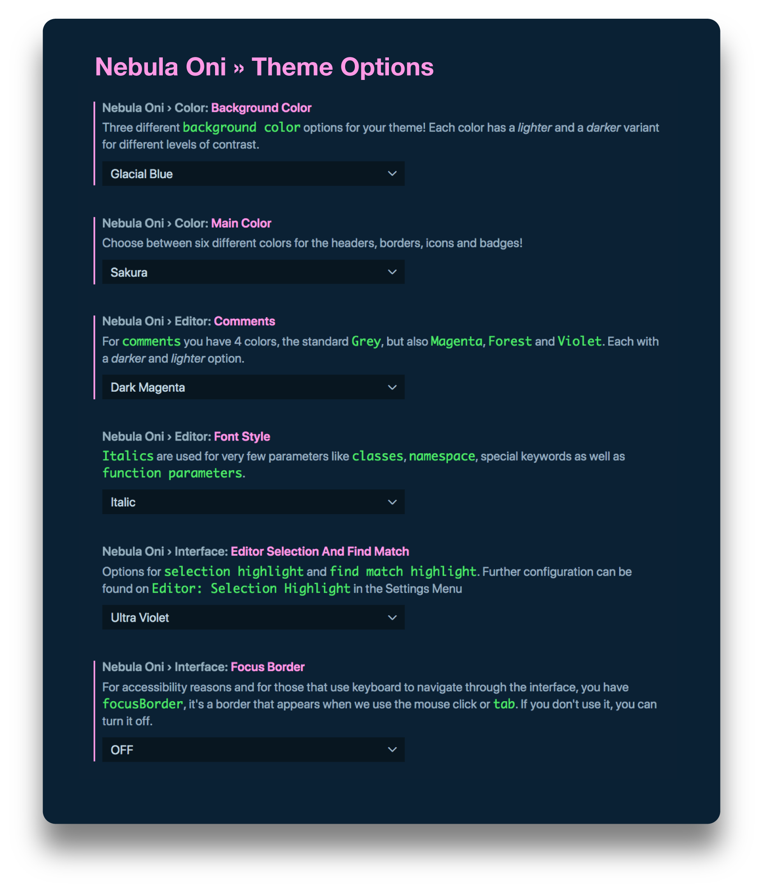

[
⬆
](#table-of-contents)

## Oni UI

There are a lot of small details and **visual hints** that can make your life a lot easier when interacting with an interface. So I've tried my best to combine them together and enhance the **UX/UI** of the **Visual Studio Code**.

I hope you like it and give it a try! For more info, check [Oni UI's page](./README/ONI-UI.md)

### Main Colors <!-- omit in toc -->

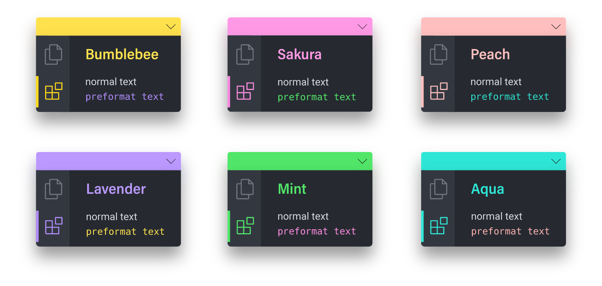

### Background Colors <!-- omit in toc -->

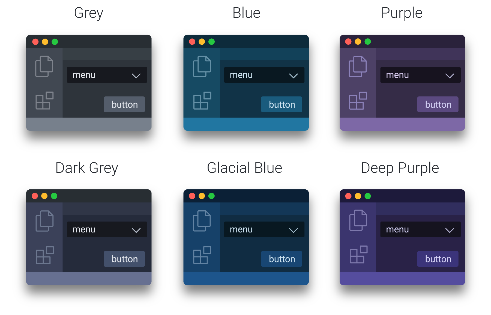

[
⬆
](#table-of-contents)

## Nebula Syntax

There are **four** different color schemes for **Nebula Syntax**. Each one has a different feel because of some unique color combinations that are different from each other, some are common for all four and some just for each pair (**Hourglass/Spirograph** and **Pegasus/Cerberus**).

### Examples <!-- omit in toc -->

#### Hourglass (Javascript) <!-- omit in toc -->

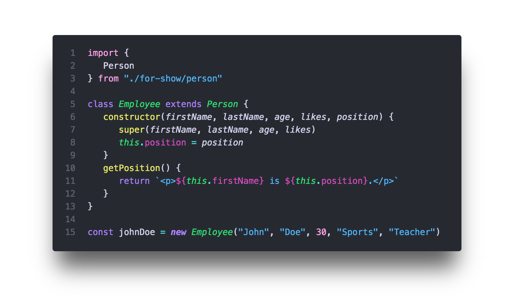

#### Pegasus (JSON) <!-- omit in toc -->

\*_Color Schemes_ for _JSON_ are split into pairs (_Hourglass/Spirograph_ and _Pegasus/Cerberus_)

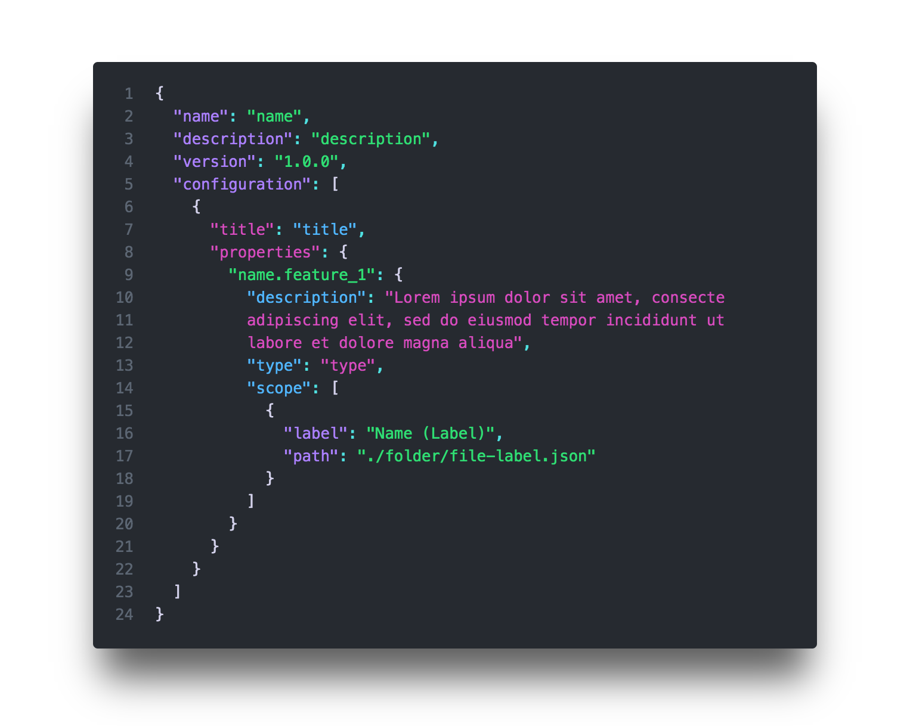

#### Spirograph (Markdown) <!-- omit in toc -->

\*_Markdown_ is the same for all _Color Schemes_

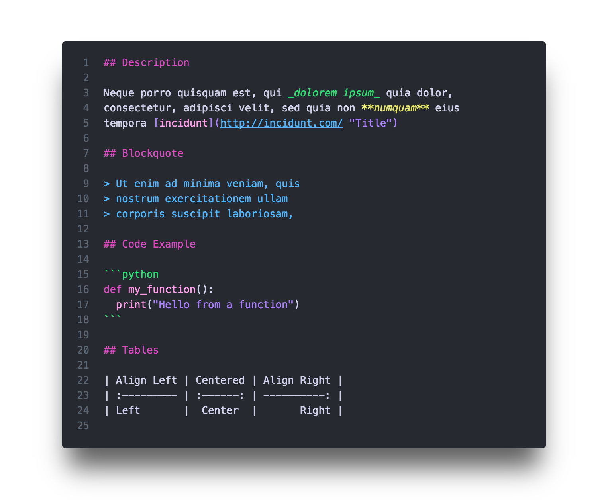

#### Cerberus (HTML) <!-- omit in toc -->

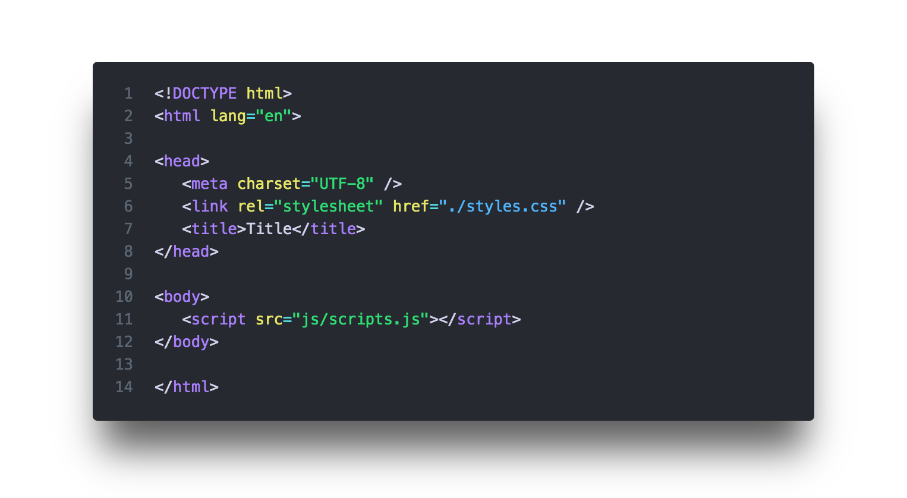

[
⬆
](#table-of-contents)

## Theme Features

### Selection Highlight and Find Match Highlight <!-- omit in toc -->

When you make a selection, the matching text will be highlighted in **Violet**, so it's easier to find other instances of the same word.

With **Find Match**, the matched word in focus will have a **border** that matches the **Oni UI** color and the other selections will be highlighted in **Violet**.

For those that might not be onboard with the **Violet** selection, there is a **Clear**, standard option, with something more neutral.

#### Ultra Violet <!-- omit in toc -->

#### Clear <!-- omit in toc -->

[
⬆
](#table-of-contents)

### Focus Border <!-- omit in toc -->

It's a **border** that appears on mouse clicks and through keyboard navigation. If you don't need it, there is the option to disable it.

_
 (Main Color: Aqua / Background: Purple) 
_

[
⬆
](#table-of-contents)

### Italic <!-- omit in toc -->

**Italic** is basically used for `classes`, `namespace`, `interface` and special cases like `this`, `self`, `super`, etc. This theme uses **Semantic Highlight** because that was the only way to target `function parameters`.

For now you have less fine tuning with **Semantic Highlight**, but it helps you identify things much faster when coding, so I ended up dropping all the work I've done on textmate scope and started from scratch to make the theme compatible with **Semantic Highlight**.

### Comments <!-- omit in toc -->

There are 4 colors for comments, the standard **grey**, but also **violet**, **magenta** and **forest**, each of the colors have a lighter and a darker version, for a total of **8 options**.

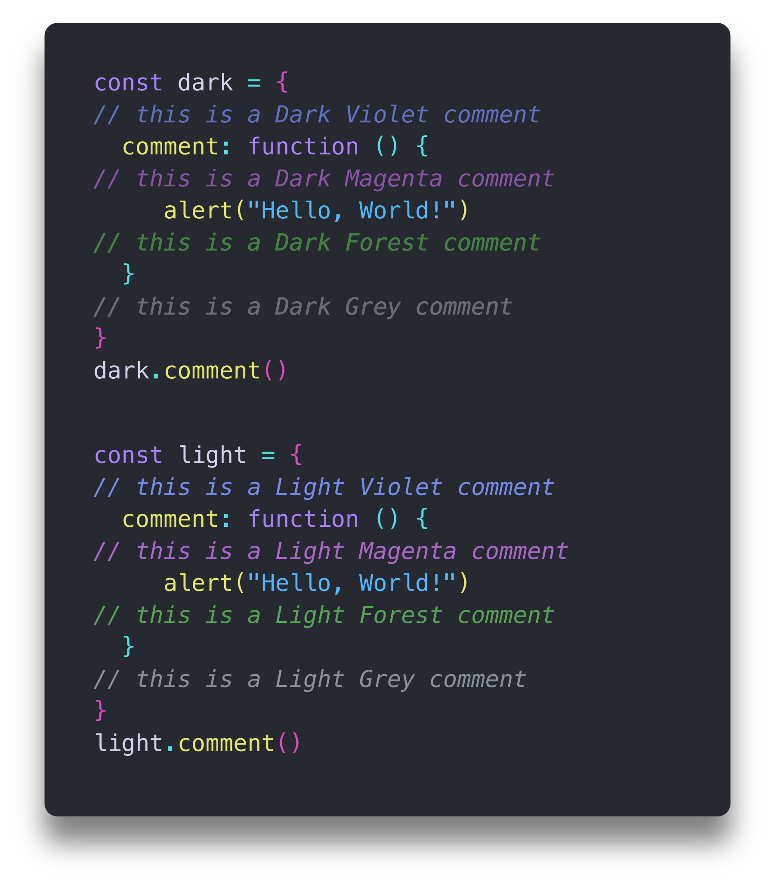

[
⬆
](#table-of-contents)

### Side Bar and Activity Bar <!-- omit in toc -->

The background and foreground colors help you easily find which file is open, what is selected and what is in focus.

Hovering over the items will highlight the text with the same color as the **Oni UI Main Color**.

The selection in focus is a bright white text so it doesn't interfere with **Git Decorations** or **Errors** colors when using the file **Explorer**.

_
 (Main Color: Lavender / Background: Dark Grey) 
_

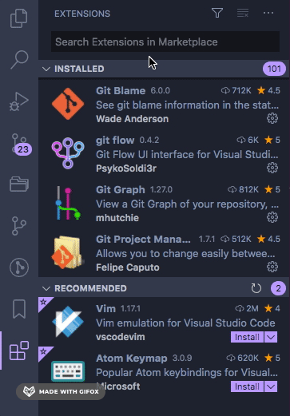

### Command Palette <!-- omit in toc -->

_
 (Main Color: Sakura / Background: Glacial Blue) 
_

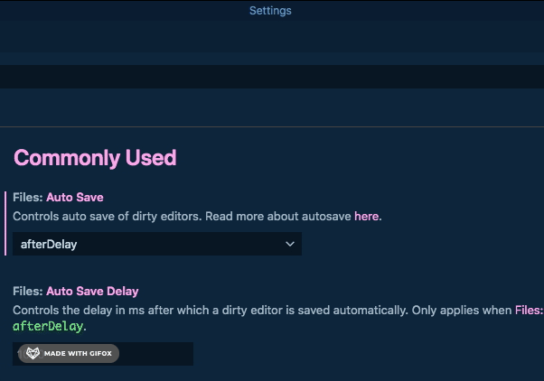

[
⬆
](#table-of-contents)

### Color Information <!-- omit in toc -->

These colors are used across the **mini map**, **editor gutter**, **notifications**, **git decorations** and **warnings** so users can easily identify what's going on in a glimpse.

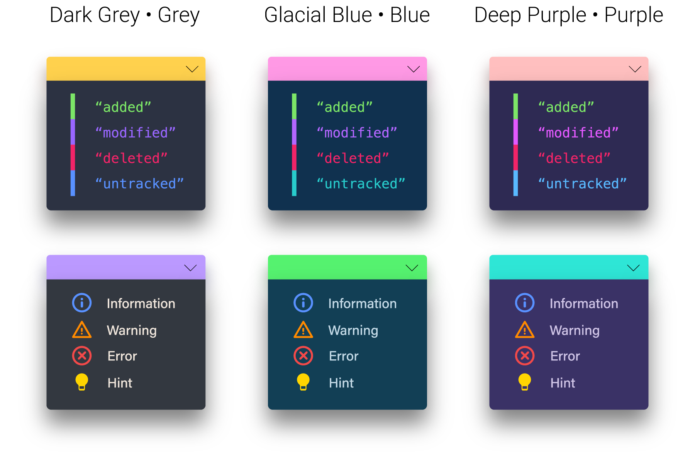

[
⬆
](#table-of-contents)

### Tabs <!-- omit in toc -->

The **Tabs** have different background colors, border and text so it's easier for you to identify which one is **open** or what is in **focus**.

_
 (Main Color: Mint / Background: Dark Grey) 
_

[
⬆
](#table-of-contents)

### Panel and Terminal <!-- omit in toc -->

I tried to select colors that are easy to read but it's still compatible with terminal customizations like **ZSH shell**.

For more information on how to customized it, check [VSCode Customization's page](./README/CUSTOMIZATION.md).

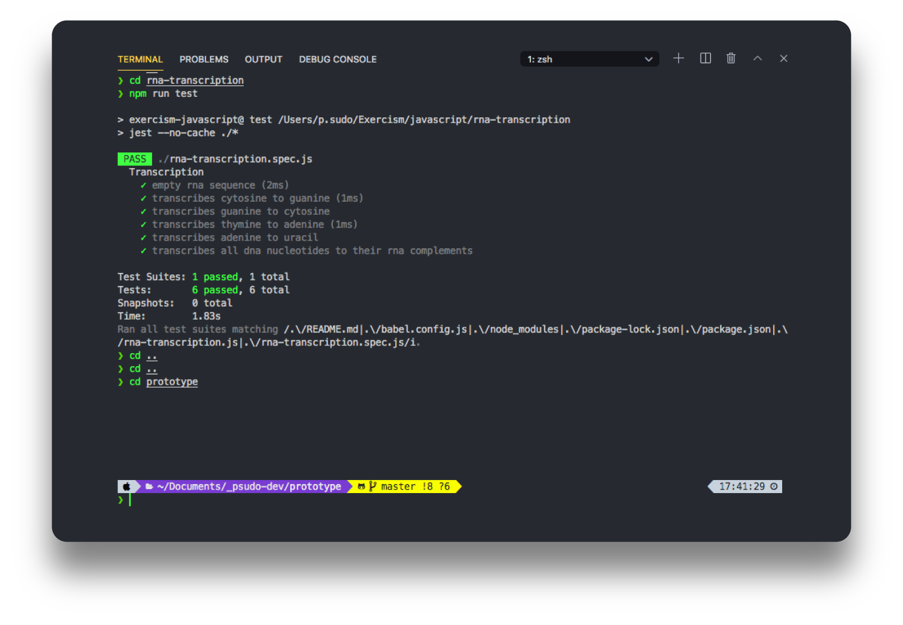

[
⬆
](#table-of-contents)

## Extensions

I've customized extensions that are color-related, so if someone would like colors that match the `Nebula Syntax` colors, I'm sharing my settings for these **[Extensions](./README/EXTENSIONS.md)**.

### Better Comments <!-- omit in toc -->

### Bracket Pair Colorizer and Indent Rainbow <!-- omit in toc -->

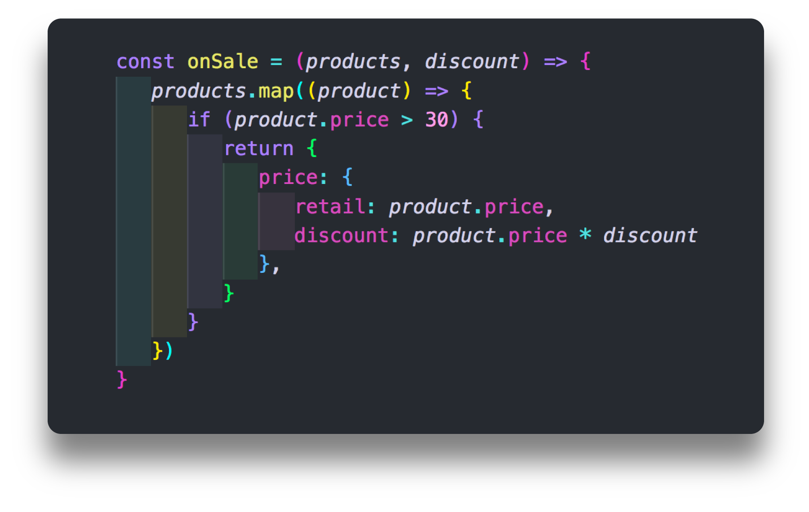

[
⬆
](#table-of-contents)

## VSCode Customization

If you want more information on how to customize your **Oni UI** and **Nebula Syntax**, I made this [quick guide](./README/CUSTOMIZATION.md) with the basics to customize the workbench and the syntax.

[
⬆
](#table-of-contents)

## More Info <!-- omit in toc -->

-  [Oni UI](./README/ONI-UI.md)
-  [Nebula Syntax](./README/SYNTAX.md)
-  [Extensions](./README/EXTENSIONS.md)
-  [VSCode Customization](./README/CUSTOMIZATION.md)

## Release History

-  [more information](https://github.com/psudo-dev/nebula-oni-theme/releases/)

## Issues and Suggestions

-  [more information](https://github.com/psudo-dev/nebula-oni-theme/issues/new/choose)

## References and Links

-  [ZSH Terminal Customization](https://medium.com/@shivam1/make-your-terminal-beautiful-and-fast-with-zsh-shell-and-powerlevel10k-6484461c6efb)
-  [Nerd Fonts](https://www.nerdfonts.com/)
-  [VSCode Workbench Customization](https://code.visualstudio.com/api/references/theme-color)
-  [Syntax Highlight Guide](https://code.visualstudio.com/api/language-extensions/syntax-highlight-guide)
-  [Semantic Highlight Guide](https://code.visualstudio.com/api/language-extensions/semantic-highlight-guide#semantic-token-classification)

[
⬆
](#table-of-contents)

## Author

I'm just getting into programming. This project was supposed to be something very simple but it got bigger and bigger and instead of just a few days or weeks, it ended up taking months. I've probably have one or two more Themes and I'm considering maybe creating Icons, who knows?

If you want to support this theme, would you consider:

-  **sharing** this theme with friends and colleagues
-  **rating** it on Visual Studio Code **[Market Place](https://github.com/psudo-dev/nebula-oni-theme)**
-  giving it a **star** on **[Github](https://github.com/psudo-dev/nebula-oni-theme)**

And if you **really** liked this theme, would you consider [buying me a coffee](https://buymeacoff.ee/psudo.dev)?

Thanks,

[ [psudo.dev](https://github.com/psudo-dev/) ]

## License

-  [Apache 2.0](./README/LICENSE.md)
