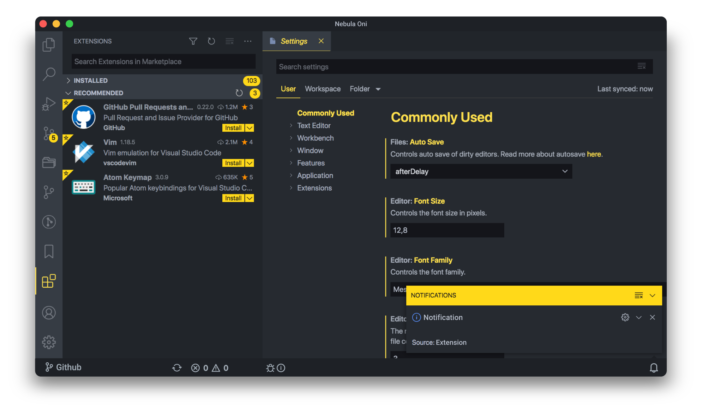
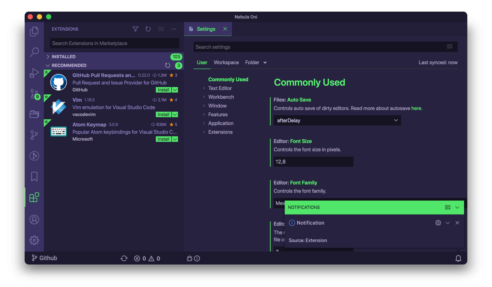
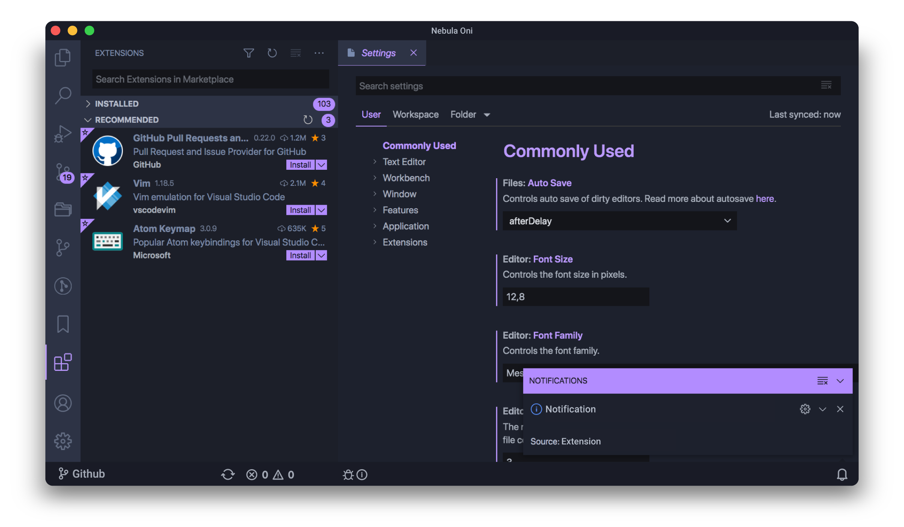
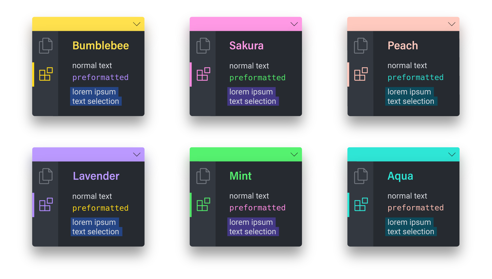
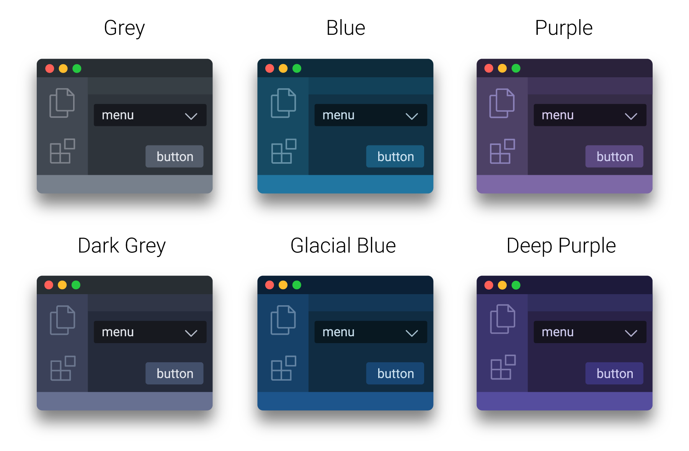
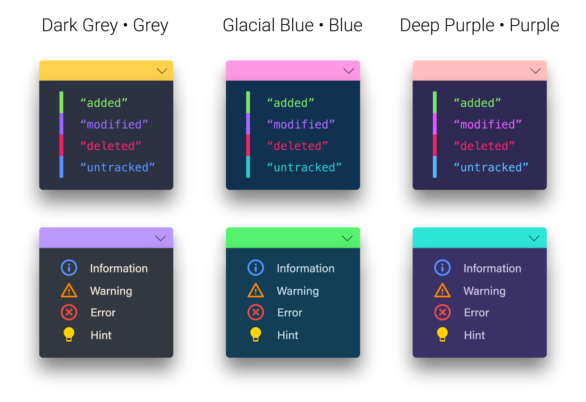
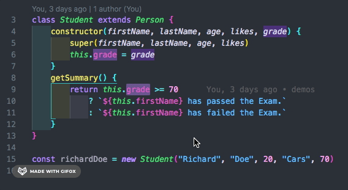
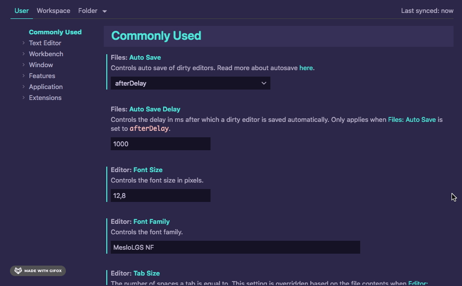

### [◂ HOME](../README.md) <!-- omit in toc -->

## Oni UI <!-- omit in toc -->

There are a lot of small details and visual hints that can make your life a lot easier when interacting with an interface. So I've tried my best to combine them together and enhance the **UX/UI** of the **Visual Studio Code**.

I find something that can be improved, I will try it, test it, change it, tweak it until it feels right - or quite, because there is always something new.

### Table of Contents

- [Main Colors](#main-colors)
- [Background Colors](#background-colors)
- [Information Colors](#information-colors)
- [Selection Highlight and Find Match Highlight](#selection-highlight-and-find-match-highlight)
- [Focus Border](#focus-border)
- [Side Bar and Activity Bar](#side-bar-and-activity-bar)
- [Command Palette](#command-palette)
- [Tabs](#tabs)
- [Panel and Terminal](#panel-and-terminal)

## Examples <!-- omit in toc -->

_
 (Main Color: Bumblebee / Background: Grey) 
_

_
 (Main Color: Peach / Background: Blue) 
_

_
 (Main Color: Mint / Background: Purple) 
_

_
 (Main Color: Lavender / Background: Dark Grey) 
_

_
 (Main Color: Sakura / Background: Glacial Blue) 
_

_
 (Main Color: Aqua / Background: Deep Purple) 
_

## Main Colors

You have **six** different options for your **Main Colors** and combined with the different **Background Colors**, you can mix and match it, adding your own flair to **Oni UI** and customize the **Nebula Oni Theme** to your taste.

I separated them into pairs - **Bumblebee/Lavender**, **Sakura/Mint** and **Peach/Aqua** -, each color has 2 different tones, although mostly imperceptible. For the pair, one color becomes the **preformatted text** color of the other while both share the same **text selection** color.

[
⬆
](#table-of-contents)

## Background Colors

There are **six** options for the background colors. **Grey** and **Dark Grey**, **Blue** and **Glacial Blue**, **Purple** and **Deep Purple**. That way you can choose different contrast-ratio for your theme depending on your preferences and working environment lighting.

[
⬆
](#table-of-contents)

## Information Colors

These colors are used across the **mini map**, **editor gutter**, **notifications**, **git decorations** and **warnings** so users can easily identify what's going on in a glimpse.

Each **Background Color** pair requires different colors, **Blue** and **Glacial Blue** have a different kind of **blue** and **purple** which is also different for **Purple** and **Deep Purple**.

[
⬆
](#table-of-contents)

## Selection Highlight and Find Match Highlight

I think that **Selection Highlight** and **Find Match Highlight** are underutilized features because it can make so much easier to spot whatever you select.

I chose **Violet** because it's an easily identifiable color and it was the color that provided the best contrast for all the different text colors. So if you select a word, you can quickly identify other instances of the same word in your code.

When using **Find Match** the matched words will have the **Violet** selection while the word in focus will have a border that matches the color of the **Oni UI** so it helps isolate the selection from the others.

#### Ultra Violet <!-- omit in toc -->

\*_In some situations it only activates when you double click the word_

#### Clear <!-- omit in toc -->

[
⬆
](#table-of-contents)

## Focus Border

I was going to simply make it invisible because I didn't see much use for it except making it look like sometimes that border shouldn't be there.

_
 (Main Color: Aqua / Background: Purple) 
_

It's mainly there for accessibility but also for those that navigate the UI using the keyboard.

I decided to let **Focus Border** active as the default, but you can disable if you don't need it, it will look cleaner.

[
⬆
](#table-of-contents)

## Side Bar and Activity Bar

The **Side Bar** selection blends in with the **Activity Bar** and it makes it easier to know which file is open and what you are selecting. The rest of the files have a different text color, a bit darker but still readable.

The **selected file** has a bright text so it's easier to spot it and it won't be confused by any **git decorations**, **errors colors** or the **inactive files**. **Drag and Drop** uses the same color as the **Activity Bar** but with less opacity.

It was all thought in a way to not get in your way, **Oni UI** tries to make things quicker and a little bit more intuitive.

_
 (Main Color: Lavender / Background: Dark Grey) 
_

[
⬆
](#table-of-contents)

## Command Palette

_
 (Main Color: Sakura / Background: Glacial Blue) 
_

[
⬆
](#table-of-contents)

## Tabs

The **colored border** indicates which tabs are opened and the **colored title** shows which tab is **in focus**. The background color of these tabs are the same as the **activity bar**, making it quite easy to know what's selected or open because the tabs pop in front of the others.

The **inactive tabs** don't have border and they have the same color as the **Explorer** and the **Side Bar**, so it doesn't get in your way and it blends into the background. The border that separates the pinned tabs from the other is very subtle.

But when you **hover** over them, the title is highlighted and easier to read, the background gets the same color as the editor but still not bas bright as the active tabs.

_
 (Main Color: Mint / Background: Dark Grey) 
_

[
⬆
](#table-of-contents)

## Panel and Terminal

The bottom **Panel** is one of the few sections that has a border - same as the pinned tabs - but it's almost imperceptible, it's just enough so you can differentiate where it ends and where the **editor** starts, making it look like they are on top of the **editor**.

I tried to select colors that are easy to read but it's still compatible with terminal customizations like **ZSH shell**.

For more information on how to customized it, check [VSCode Customization's page](./CUSTOMIZATION.md).

[
⬆
](#table-of-contents)
